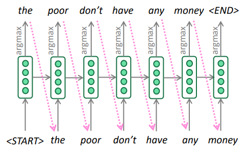

# Seq2Seq 란?

Sequence to Sequence 는 2014년 발표된 [논문](https://arxiv.org/pdf/1409.3215.pdf)에서 소개된 모델입니다.

기존의 딥러닝 모델들과는 다른점들이 있어 큰 주목을 받았는데요, 한 가지씩 알아보도록 하겠습니다.

##### 1. 입출력의 차원 제한 감소

일반적인 딥러닝 모델의 경우 입력차원과 출력차원이 정의된 상태에서 학습과 예측을 하는데,

Seq2Seq는 입력차원과 출력차원의 정의에서 비교적 자유롭습니다.

한 예로,

일반적인 딥러닝 모델에서는 '좋은 아침이야' 와 '오늘 날씨가 좋네' 를 같은 모델의 입력으로 넣으려면

문장의 길이를 자르거나, 임베딩을 통해 같은 차원으로 맞추어 주어야 합니다.

그에 비해 Seq2Seq 는,

'좋은 아침이야' 와 '오늘 날씨가 좋네' 를 같은 모델의 입력으로 넣을 수 있습니다.

이 때 디코더의 입출력 부분에서 <START> , <END> 토큰을 사용함으로서 문장의 시작과 끝을 알 수 있습니다.

##### 2. Encoder 와 Decoder 를 사용

Seq2Seq는 다음과 같이 구성됩니다.

논문에서 설명하고 있는 가장 간단한 예제인데요 , 'ABC' 를 입력으로 넣으면 'WXYZ' 를 출력해주는 그림입니다.

(Seq2Seq의 데이터 구성은 '입력' : '정답' 이런 형식으로 구성되어야 합니다.)

ABC 를 넣는 부분을 **Encoder** 라고 하는데, 각 과정은 LSTM 셀로 구성되어 있습니다.

(보통 RNN 계열의 셀로 구성을 하는데, 논문에서는 긴 문장의 처리를 위해 LSTM 셀로 구성했습니다.)

Encoder 부분에서는 입력문장들을 인코딩해 다음 셀로 넘기고,  최종적으로 Encoder 의 마지막 셀인 C 부분에서 입력문장들의 최종 인코딩 내용을 Decoder 의 initial hidden state로 제공합니다.

정리하자면 Encoder 의 입력은 문장이고, 출력은 문장을 인코딩한 hidden state 입니다. 

WXYZ 를 출력으로 가지는 부분을 **Decoder** 라고 하는데, 이 과정 역시 LSTM 셀로 구성되어 있습니다.

Decoder 의 입력은 <START> 토큰으로 시작하고, 정답 문장을 입력으로 사용합니다.

Decoder 의 출력은 디코딩 된 문장들이고 <END> 토큰으로 끝이 납니다.

(그림에서는 <START> 와 <END> 토큰을 묶어 <EOS> , End Of Sentence 로 표현했습니다.)

##### 3. Beam Search

Decoder 의 학습 과정에서 논문에서 제안한 방법은 **Beam Search** 라는 방법입니다.

일반적으로 LSTM 셀에서 사용하는 argmax 방법은 아래 그림과 같습니다.

각 셀을 거칠 때 마다 최대 확률값을 갖는 단어를 출력값으로 학습하는 것인데요, 

중간에 잘못 예측한 단어가 있으면 다음 단어의 학습에도 영향을 주기 때문에 번역에서는 큰 문제가 될 수 있습니다.

이러한 문제를 해결하기 위해 Beam Search 방식을 사용합니다.

각 셀에서 k 개의 후보군을 두고 (그림에서 k = 2) , 문장의 끝에서 각 가설의 argmax 를 통해 최종 출력 문장을 결정합니다.

주의할 점은 이 방법은 예측이 아닌 학습 방법에서 사용한다는 점 입니다.

학습을 할 때에는 '입력:출력' 쌍이 있기 때문에 위 같은 방법을 사용할 수 있지만, 예측을 할 때에는 '입력' 만 존재하기 때문에 위 같은 방법을 사용하지 않습니다.

##### Seq2Seq 모델의 단점

좋은 시도라고 해서 단점이 없는것은 아닙니다.

Seq2Seq 모델에도 치명적인 단점이 있는데, 바로 보틀넥 (bottleneck) 문제입니다.

인코딩 과정에서 입력문장의 모든 정보를 알아야 하는데, 문장이 길어지면 모든 정보를 알기 힘들다는 점입니다.

LSTM 셀을 이용해 Long Term 메모리에 강하도록 만들었지만 완전한 해결책은 아닙니다.

그래서 고안된 것이  **Attention** 이라는 방법인데요,

간단히 말하자면 긴 문장 중에서도 내가 원하는 부분을 주의깊게 보자는 의미입니다.

Attention 에 대해서는 다음 포스팅에 이어서 하도록 하겠습니다.

 