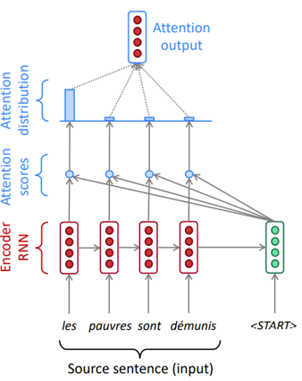
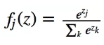
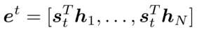

# 어텐션 (Attention) 방법

앞의 Seq2Seq 포스팅에서 말했듯이, Seq2Seq 의 문제점은 문장이 길어질 때 발생합니다.
 이를 보완하기 위해 어텐션 방법을 도입해 문장 전부가 아닌 핵심부분에 집중해서 보고자 했습니다.
 이번 포스팅에서는 어텐션 방법에 대해 알아보도록 하겠습니다.

>  본 포스팅은 [cs224n Attention](http://web.stanford.edu/class/cs224n/lectures/lecture10.pdf) 과 [ratsgo's 님의 블로그](https://ratsgo.github.io/from%20frequency%20to%20semantics/2017/10/06/attention/) 를 참조해 작성했습니다.

첫번째 les 라는 단어에 대한 학습 과정을 예시로 들어보겠습니다.

우선 디코더의 input 으로 들어간 state와 , 인코더의 각 단어에 대한 state 들을 내적해 Attention Score 를 계산합니다.

그림의 경우 input 문장의 단어가 4개 이므로 네 개의 attention score 가 계산된 것을 알 수 있습니다.

그 다음에는 score 들의 확률값을 계산해주어야 하는데 사용하는 것이 softmax 입니다.

softmax 는 확률값으로 해석하기 용이한 형태로 변형해주기 위해 주로 사용하는 함수입니다.

위와 같은 수식 (softmax) 을 거치게 되면 score 들은 확률값 을 가지게 됩니다. 

그림의 경우 첫번째 단어 예측에는 첫번째 단어의 score 값의 확률값이 가장 큰 것을 볼 수 있습니다.

attention distribution 과 인코더의 hidden state 를  가중합 해주면 attention output 을 계산할 수 있습니다.

이 attention ouput 과 디코더의 hidden state 를 concat 해 현 시점의 hidden state 벡터를 만들어 내는 것입니다.

각 단어의 학습과정에서 새로운 attention ouput 을 계속 만들어내게 되고, 단어의 학습 과정에서 사용함으로서 어떤 단어를 주목해서 봐야 하는지가 반영됩니다.

위의 설명을 수식을 통해 좀 더 자세히 보겠습니다.

input 문장에 N개의 단어가 있다고 할 때, 인코더는 $h_1, ... , h_N$ 인 hidden state 를 가집니다.

t 번째 시점에서 디코더는 $s_t$ 인 hidden state 를 가집니다.

이 때 attention score $e^t$ 는 다음과 같이 계산할 수 있습니다.

 											

